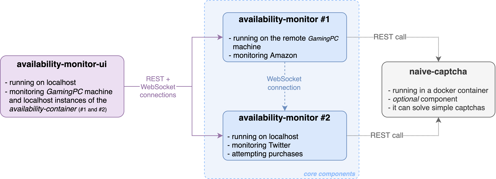

YaaS - Yet Another Amazon Scraper
---------------------------------
> _Yet Another Amazon Scraper_, or _YaaS as a Service_, you pick! (And yes, I'm terrible with names...)

YaaS (horrible name) is a tool originally created to buy a GPU in this hell of a market. In practice it can be used to monitor any Amazon product (e.g. gpu, cpu, consoles) and it will aggressively attempt to buy it once available.

> **Quick spoiler: the juicy stuff is under the [`availability-monitor` component](./availability-monitor/).**

This project is far from perfect and it might be outdated (because Amazon does a fair job of preventing bots), but it actually served its purpose last year (scored a Zotac 3060 Ti, not the EVGA 3080 XC3 I was dreaming of, but it has been a notable upgrade from my now dead Zotac 970).

Compared to other tools it's more difficult to use, but oh boy it will not give up easily! Once an item is available, main strategy is to go back and forth between the product page and the shopping basket until the iteam appears (context: on Amazon a gpu will disappear from your basket if you are not fast enough). In the happiest of the paths (the item is available), the purchase is completed in less than a couple of seconds (open product page > open basket > go to checkout > optionally deny amazon prime > buy).

Given that the situation did not improve over the past year, I'm now opensourcing it in the hope that another poor soul will manage to get their beloved console or graphic card.

Note: **this code is dirty**. This code is very dirty and I know it. Dear fellow developer, please _forgive me_ and just consider the sheer amount of hours I spent on this that I'm now giving to you. I never used puppeteer, tesseract and many other libraries before, I now know there are many things that could have been done better.

In this repository there are the three pieces I prototyped to get the job done:
 - [`availability-monitor`](./availability-monitor/) (NodeJS, TypeScript) is the main component and it's quite complex, dig into its readme for the details.
 - [`availability-monitor-ui`](./availability-monitor-ui/) (React, TypeScript) is a small ui to monitor the status of the queries and the attempts (a live table is much easier to read than flashing text on a terminal).
 - [`captcha-solver`](./captcha-solver/) (Python, Tesseract, Docker) is a quite useless component to solve captchas. It has a precision of less than 10% and it's used to avoid using 2captcha all the time, but I think it's just simpler to rely on the latter.

|  |
| --- |
| _Example of running instances and how they are connnected_ |

Last but not least, I would like to thank my girlfriend. I spent quite many nights writing this code rather than watching a movie together, crawling back in bed late at night. Thanks for the patience!