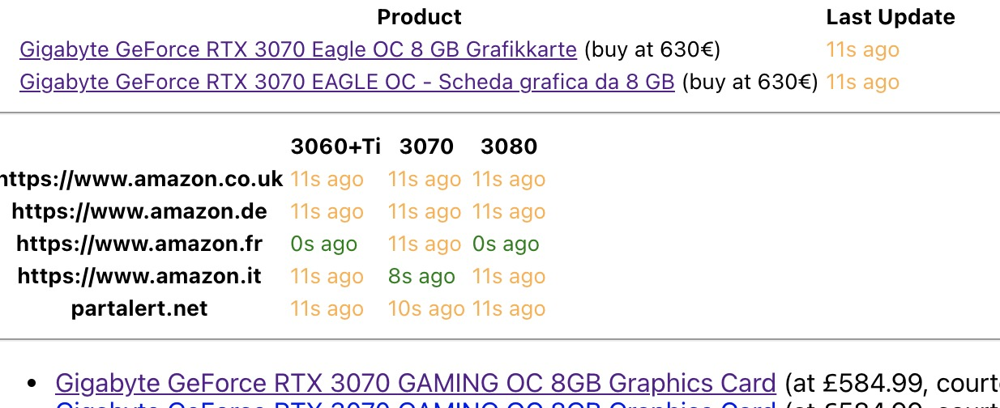
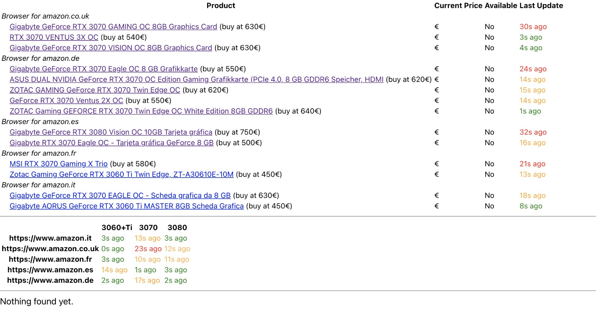

The _availability-monitor-ui_ is a frontend application that connects to one or more instances of _availability-monitor_ and shows the monitoring status and purchase attempts in a tidy way. One of the issue of the _availability-monitor_ is that it is not easy to have a global overview of what's going on reading only the terminal. Therefore, _availability-monitor-ui_ takes all the monitored items and shows them in a list / table, with a timer indicating when the last check has been performed (with a green/yellow/red colour based on the lenght of the delay).

|  |
| --- |
| _Figure 1: A very badly cropped screenshot_ |

Figure 1, which has been badly cropped, shows a very simple backend configuration. Reading from the top towards the bottom:
 - The are only two links being monitored (the 3070s)
 - There are three searches continuosly ran on a few marketplaces (not that PartAlert counts as search watcher)
 - There have been some purchase attempts

In this instance, the backend had some sleep to avoid bombing Amazon servers, but delays can be reduced by tweaking the code.

|  |
| --- |
| _Figure 2: Another screenshot, with a few more links and different marketplaces_ |

## Configuration

Before starting the component, you must insert the list of servers running the _availability-monitor_  in the `serverList` variable under `src/connection/listener.ts`. I know it's dirty, I know there are way better solutions, but keep in mind this is just a prototype...

The main trick driving the updates is the half-second timer started in `src/App.tsx` from method `startClock()`. All the watchers updates are received through websocket, but it is an overwhelming quantity for the browser to handle (too many rendering). Therefore, a much lighter approach is to have a store for all the delays, and a recurring timer of 500ms to re-render the status.

## Available Scripts

This project was bootstrapped with [Create React App](https://github.com/facebook/create-react-app), check it out for more detail.

In the project directory, you can run:

### `npm start`

Runs the app in the development mode.\
Open [http://localhost:3000](http://localhost:3000) to view it in the browser.

The page will reload if you make edits.\
You will also see any lint errors in the console.

### `npm test`

Launches the test runner in the interactive watch mode.\
See the section about [running tests](https://facebook.github.io/create-react-app/docs/running-tests) for more information.

### `npm run build`

Builds the app for production to the `build` folder.\
It correctly bundles React in production mode and optimizes the build for the best performance.

The build is minified and the filenames include the hashes.\
Your app is ready to be deployed!

See the section about [deployment](https://facebook.github.io/create-react-app/docs/deployment) for more information.

### `npm run eject`

**Note: this is a one-way operation. Once you `eject`, you can’t go back!**

If you aren’t satisfied with the build tool and configuration choices, you can `eject` at any time. This command will remove the single build dependency from your project.

Instead, it will copy all the configuration files and the transitive dependencies (webpack, Babel, ESLint, etc) right into your project so you have full control over them. All of the commands except `eject` will still work, but they will point to the copied scripts so you can tweak them. At this point you’re on your own.

You don’t have to ever use `eject`. The curated feature set is suitable for small and middle deployments, and you shouldn’t feel obligated to use this feature. However we understand that this tool wouldn’t be useful if you couldn’t customize it when you are ready for it.

## Learn More

You can learn more in the [Create React App documentation](https://facebook.github.io/create-react-app/docs/getting-started).

To learn React, check out the [React documentation](https://reactjs.org/).
