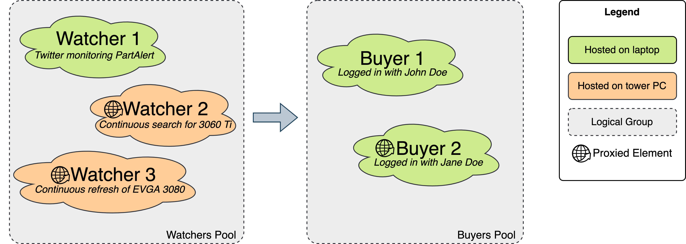

_Availability Monitor_ is the only component you need for the purchase of an item from Amazon (or other store, if you have the patience to write your own adapter) when available. It is designed to work in a distributed fashion to scatter both workload and chances to be caught by Amazon, using websockets for near real time communications. It also exposes some websockets and REST APIs for status monitoring through the _availability-monitor-ui_ component (which shows the same output of the terminal, but tidied up in a UI).

**This is a prototype, not a ready to use tool, please read the whole guide first before starting to use it.**

I'll try to describe this bot through a few sections:
 - [Brief description of the problem](#brief-description-of-the-problem)
 - [Components Overview](#components-overview)
 - [Project folders overview](#project-folders-overview)
 - [Watchers in detail](#watchers-in-detail)
 - [Watchers genesis](#watchers-genesis)
 - [Some detail about buyers](#some-detail-about-buyers)
 - [How to use it](#how-to-use-it)
 - [Some development links](#some-development-links)

As a disclaimer, this project is written in TypeScript because its optional typing makes it easy to read, and I find the single thread / event loop model extremely performant and well shaped for this use case. That being said, I self-taught myself TypeScript, and I never used puppeteer, 2captcha, Twitter APIs and many other libraries before this project, and I now realise many things could be done in a easier and / or more performant way.

## Brief description of the problem

There are a few bots already available online to make a purchase on Amazon, here are a few things I tried first:
 - [A guide on how to make a bot and connect it to discord](https://leonyapkl.medium.com/how-to-buy-a-rtx-3000-graphics-card-as-a-software-engineer-d7ebca7301fd), with the [Amazon parser available on github](https://github.com/kai101/AmazonMonitor/blob/master/common/Amazon.js)
 - Article on [how to Scrap Websites Like Amazon Using Node.js](https://medium.com/swlh/how-to-scrap-websites-like-amazon-using-node-js-c519a5e41d91), but it's mostly a very basic guide to Puppeteer though
 - [An existing solution in python called public-amazon-crawler](https://github.com/hartleybrody/public-amazon-crawler), it doesn't seem to handle errors (the empty basket)

Overall, most (if not all) available solutions online don't deal with the edge case of _the item is available for a few seconds only and will disappear from your basket in the blink of a second_. Too bad.

Therefore, these are a list of problems I tried to tackle with this project:
 - 🏎 **Overall speed:** If everything goes smoothly, a purchase is completed in less than a couple of seconds. 
 - 🔐 **Password management:** no need to save Amazon password anywhere (or even disable 2FA), this bot will connect to an existing instance of your Chrome, already logged in on Amazon.
 - ♻️ **Aggressive refresh:** Once an item is alerted (e.g. a tweet about its availability was just received), a page will be opened and refreshed like hell until available (possibly sold and delivered by Amazon, to avoid scams). Internally, the bot won't even wait until the page is fully parsed / loaded, but the refresh will be forced as soon as the availability is known (normally, a bot waits for a page to be downloaded before continuing).
 - 💸 **Price check:** Once an item is finally available and its price is within acceptable range (customly defined), it will attempt a purchase.
 - 🧓 **Leveraging browser history:** If the item disappeared from the basket (very, very common), the bot will start to go backwards in the history and attempt to add to basket over and over again (going back in history will preserve the "Add to basket" button), until succesful.
 - 👩‍💻 **Captcha solver:** If a captcha will be asked at any stage, 2captcha will be used to solve it (and optionally a custom free captcha solver, although with a very bad accuracy).
 - 🕵️‍♀️ **Monitoring for products:** It can monitor for a list of cards until they are available. Performances are very similar to existing services such as PartAlert or DropSentry, not sure it's worth the hassle to be honest since they can be used directly.
 - 🕵️‍♂️ **Monitoring for search keywords:** It can monitor for search keywords rather than a list of cards. Performances will be better when new graphic cards are released (e.g. I had an edge when the water cooling models started to be released), but in reality I'm not sure it's worth the effort. In my case, this bot woke up when the Gigabyte water cooled GPUs have been released, but their price was way out of budget, so no purchase has been attempted.
 - 🌎 **Multiple proxy support:** Every single component could use its own proxy. For example, you can have two Chrome instances, one using your network and one coming out from a different one. As well, all the search functionalities can be proxied through different services, to scale better (Amazon load balancer limits every IP to make at most 1 query per second). Note: authenticated proxies are not supported.
 - 🏘 **Distributed**: you can compose the bot in the way you want, and then have a single buyer on one machine attempting the purchase. Start the bot on different machine, and websockets will take care of near real time alerts.
 - 📡 **Bandwidth conscious:** Overall, this project tries to cut bandwidth as much as possible. REST APIs cannot be used for a purchase, but for the polling part this project tries to mimic a browser headers to save memory (including csm-hit header). During the purchase part, the bot can block any useless connection (e.g. CSS, ads, ...) to speed up the process.
  - 💾 **Memory conscious**: Chrome is very greedy, and continous refreshes kill the memory. To avoid this, the bot will open / close tabs from time to time for chrome to release some memory and keep things under control.
  - 📝 **Meaningful logging:** Given the amount of tabs open and things to keep under control (especially when a purchase is attempted), the logs are grouped by category and coloured to ease readability.

Although this bot is quite fast & aggressive, it's worth mentioning that you might be still slowed down by Visa 3DS system (or the equivalent Mastercard). Basically, when making an expensive purchase, Amazon will trigger the two factor confirmation with your credit institution. In my case, this caused the items to disappear ... A solution could be to have a considerable amount of money in your Amazon wallet as gift card, but ... it's a solution for a scalper that does this for a job, more than an amateur trying to get one graphic card ...

## Components Overview

At its core, there are only two main abstractions to have in mind:
 - A **Watcher** is a never ending function that monitors for availability of one or more products. The reason for this abstraction is to have a unified way to deal with the different strategies to check for a product availability: monitoring one or more twitter accounts, doing a continuous search for a name on Amazon, continuosly refreshing a product page on Amazon.
 - Once a product is available, it is passed to a **Buyer**, which... well, it will try to buy it!

To make things safer, any watcher or buyer can be individually proxied (e.g. a buyer could be proxied through your friend apartment, a watcher can be proxied with a commercial VPN). To reduce the workload, any watcher or buyer can be run on any machine of your network.

|  |
| --- |
| Overview of the presented components |

To make a practical example, this has been my home setup:
 - Available resources:
   - Me and my friend [@charliemaiors](https://github.com/charliemaiors) have the same Synology router and NAS. I live in Ireland and he lives in Italy, but our networks are merged together, and we both expose a squid proxy to each other.
   - I have a virtual DSM running always within Unlimited VPN (thanks to [VPNUnlimited2Syno](https://github.com/Barben360/VPNUnlimited2Syno) project for the configuration scripts), which exposes another proxy.
   - I have two machines: a daily development laptop (MacBook 2018) and a gaming pc (i5 8th gen, 32GB of ram, GTX 970)
 - Availability monitor configuration:
   - The macbook hosted the buyer and the twitter watcher (listening for PartAlert and DropSentry)
   - The gaming pc was doing the continuos search for new graphic cards and refreshing over a selection of desired graphic cards
   - Once something was available, the MacBook was attempting a purchase. Since the MacBook is in front of me most of the time, I would also notice what's going on.

Note that this bot managed to score me a GPU a few times, but Amazon cancelled the order after a few months in many occasion (I'm still crying over the EVGA 3080 XC3 ordered from Amazon France but was never dispatched...).

If you have the patience, this project can be easily adapted to work with any online retail store (in the beginning I was monitoring other ones as well). In my opinion, Amazon is the most trustworthy shop, therefore I ended up not bothering too much with other places.

## Project folders overview

```
availability-monitor
│
├── cache                           # Temporary session data when simulating a browser
│
├── data                            # Data used during development 
│   ├── amazon-screenshots          # Screenshot of all the amazon html pages
│   ├── misc                        # Random JSON files
│   ├── playground                  # Quick tests
│   ├── sounds                      # Sound effects!
│   └── watchers                    # Configuration data for the watchers
│
├── dist                            # Temporary compiled data
│
├── src                             # Source folder
│   ├── amazon-buyer                # Buyer code
│   ├── browser-management          # Common code for chrome managemement
│   ├── utils                       # Common utils (e.g. logging)
│   └── watchers                    # All the different watchers
│
└── types                           # TypeScript typing
```

## Watchers in detail

Watcher is the main entity to monitor for producs, and any implementation inherits from AbstractWatcher (`src/watchers/AbstractWatcher.ts`).

|  |
| --- |
| A watcher lifecycle |

As per figure, any watcher goes through a pipeline of synchronous stages:
 - during the **prepare** stage, all the required resources are instantiated. For example, for Twitter listener, an http permanent connection is opened with the Twitter servers. In the case of the products or search watchers, all the required tabs are opened, webpages are opened and cookies accepted.
 - the **start** stage will start the ~madness~ polling. During this stage the ItemFound and Heartbeat event will be triggered.
 - **destroy** event will start the cleanup
 - **shutdown** is an optional method that, if extended, will take care of custom cleanup (e.g. closing all the opened tabs).

 There are three possible types of watcher:
 - **link**: for single product monitoring 
 - **search**: for keyword based searches
 - **stream**: for live monitoring (e.g. twitter)

To simplify monitoring and message passing, all these different watchers are aggregated together under one single aggregator (class `src/watchers/WatchersAggregator.ts`). The aggregator will also take care of filtering requests that could occur multiple times (e.g. multiple watchers could signal for the same item availability, the aggregator will only pass the first signal, disabling any new for a few minutes because redundant).

This is the full list of available watchers:

| _name_                                    | _type_ | _description_                                                                                                                                                            |
|-------------------------------------------|--------|--------------------------------------------------------------------------------------------------------------------------------------------------------------------------|
| **_amazon-products-in-browser_**          | link   | Connect to the browser instance, open a tab per link / product, and refresh all the time until available. If memory usage goes too high, tab is closed and opened again. |
| **_amazon-products-on-rest_**             | link   | Simulate a browser using REST APIs, storing session data in the `cache` folder.                                                                                          |
| **_amazon-products-round-robin-on-rest_** | link   | Same as above, but items are polled in a round robin fashion, rather than bombing the Amazon server.                                                                     |
| **_amazon-search_**                       | search | Connect to the browser instance, open a tab in amazon and start to search for the keywords, until items are available.                                                   |
| **_curry-product_**                       | link   | Connect to the browser instance, open a tab and follow a link to currys.ie. Not really used.                                                                             |
| **_part-alert_**                          | link   | Attempt to avoid Twitter to check PartAlert for updates. It goes on the CloudFlare protected website and it starts to poll the REST APIs.                                |
| **_remote-watcher_**                      | stream | It connects to a running instance of this bot on another machine for updates.                                                                                            |
| **_twitter-api-v1_**                      | stream | It connects to Twitter for updates using the Twitter version 1 APIs. Note: you must be listening to the PartAlert / DropSentry / whatever account.                       |
| **_twitter-api-v2_**                      | stream | It connects to Twitter for updates using the Twitter version 2 APIs. Note: you must be listening to the PartAlert / DropSentry / whatever account.                       |
| **_terminal_**             | link   | It's a debug functionality (in `console-utils.ts`), it just allows to paste an Amazon link to trigger the buy attempt |

|  |
| --- |
| Rest poll monitoring a bunch of items from different marketplaces |


## Watchers genesis

Before moving to the buyer, is worth mentioning the timeline that brought all the different watchers.

> TL;DR I found the DropSentry and PartAlert bots to be _very_ fast, and relying on them using Twitter V1 watcher is a much lighter approach than starting any other watcher.

The long story that led me to all these different watchers can be explained with the timeline of my attempts, and the different outcomes over time:
 - **[Amazon Search Watcher]** I first thought I could do my own bot (with blackjack and hookers), therefore I started writing my own code to search for GPUs on Amazon (e.g. a continuous search for "Nvidia 3070"). I quickly learnt that Amazon doesn't like REST calls, so I picked puppeteer to simulate a browser and do all the refreshes. I solved the captcha issue (using 2captcha, mainly), but my bot was never picking any GPU (while PartAlert was still active). After some googling around, I realised that newly available items on Amazon take a while before appearing among the search results.
    - Pro: when a new item is listed on Amazon, this watcher will pick it.
    - Cons: pretty useless, it takes a while for a gpu to show up as a result.
 - **[Amazon Poller using Chrome]** Given the search-results delay issue, I quickly adapted the code to continuosly refresh over a given set of GPUs instead of searching for them. At this stage I was rarely outperforming PartAlert, and Amazon was regularly cutting me off after a few hours of monitoring. This is just unreliable.
    - Pro: it polls all the ASIN in a given list
    - Cons: Amazon will cut it off after a few hours; CPU / Memory intensive (mitigated with regular restarts)
 - **[PartAlert Poller]** If you can't beat them, join them: might as well rely on PartAlert for the hard part. Trying to avoid Twitter APIs, I first started by querying PartAlert REST APIs (e.g. [3070 rest call](https://api.partalert.net/stock-cache/rtx3070)). These APIs are behind CloudFlare, which would detect my code as a bot (rightfully). To bypass CloudFlare (and now strong with my few days expertise in puppeteer), I wrapped the REST calls through a proxied chrome instance, which did the job ... but again ... I'm hacking my way through, and CloudFlare was still blocking me from time to time ...
    - Pro: no Amazon polling involved
    - Cons: still relying on a third party service; sometimes CloudFlare might cut the bot off
 - **[Remote Watcher]** Parenthesis: given that my gaming PC is turned off during most of the day, I decided to load it with the task of polling Amazon / PartAlert and then, using websockets, attempting the purchase on my laptop when an item is found. In this way, I can do my daily task on the laptop, and when a gpu is available I could follow the purchase suddenly in front of me.
    - Pro: easy bridge between different computers.
    - Cons: none, really.
 - **[Twitter V2]** At this point I discarded the REST APIs Chrome wrap for PartAlert, too much of a hack... As next step, I explored the Twitter APIs, and since I never had to deal with them, I opted for the latest version (v2 streaming APIs). Sadly, using them, I realised there was a noticeble lag between a tweet being available and the code receiving it (up to 30 seconds delay). In a scenario were a second makes a difference, that was not acceptable...
    - Pro: lightweight
    - Cons: need a Twitter developer account; slow to pick new tweets; relies on third parties account
 - **[Twitter V1]** Therefore, I explored _also_ Twitter v1 APIs, which indeed are faster. Given the whole "watchers pool" architecture, both APIs can coexist, and the late watcher to trigger an alert would be simply ignored (the bot ignores same items that are alerted in a minute window, `isRecentDuplicate` function in `src/utils/misc.ts`). Twitter V1 turns out to be almost real time, at most one second delay. Good.
    - Pro: lightweight; little lag in picking new tweets
    - Cons: need a Twitter developer account; relies on third parties account
 - **[Amazon Rest Poller]** Am I happy? I should be. But no, I wanted to outperform PartAlert without the memory toll of Chrome. I tried to simulate a browser behaviour, but Amazon has a `csm-hit` header which is effective in noticing a bot (fair play Amazon, fair play). I went a bit mental here: I use puppeteer to fetch the headers, I inject them on the REST call, and when an update is needed I just fall back on chrome again (reusing existing tabs and restoring the chrome session, including the object storage). It actually sounds easy, but in terms of code is a real hassle, especially if you don't want to go too wild with chrome instances to save memory. Regardless, it's not efficient, since Amazon would block my IP after one hour of bombing. Understandable.
    - Pro: REST based, very lightweight, extremely fast.
    - Cons: convoluted code;  Amazon will cut it off after a few hours.
 - **[Amazon Round Robin Poller]** Basically I took the REST poller code, clustered it for top level domains, and slapped it with a round robin approach for GPUs. Does it outperform PartAlert? Sometimes. I don't have enough proxies and I don't want to spend money for that either. But at this point I have many pieces in place: the one second Amazon limit is respected, the `csm-hit` is emulated (together with a bunch of other headers), captchas are taken care of (both using 2captcha and google tesseract, to try save some moeny), it can scale well if enough proxies are provided. It's untidy code, but it works.
    - Pro: REST based, very lightweight; Amazon doesn't realise is a bot
    - Cons: very convoluted code (didn't have the time / need to simplify); the browser emulation part has to be improved

So, what happened in the end? I built all these watchers that can work together, but the most effective one has been Twitter V1 listening to PartAlert / DropSentry, which scored me a Zotac 3060 Ti from Amazon Italy! 👾

For the record, I also managed to buy an EVGA 3080 XC3 (my dream card) from Amazon France, an EVGA 3070 XC3 from Amazon Germany and an Asus TUF 3070 from Amazon UK, but money has never been taken and order has been regularly cancelled after a month or two ...


## Some detail about buyers

Amazon buyer is the only buyer available right now. `src/amazon-buyer/AmazonBuyerManager.ts` is the entrypoint, the only file worth mentioning is `is-good-purchase.ts` in the same folder. Customise `is-good-purchase.ts` to fit your spending limits (e.g. how much to spend for which brand).

At the moment, the main strategy _before_ attempting a purchase is:
 - If metadata about the item is available, do a first check to make sure is worth making an attempt
 - If it's worth, connect to the chrome instance and create a new tab to the amazon store with the provided ASIN
 - If the item is not available on the page, refresh like a mad man until it becomes available (for 30 minutes at most)
 - If the item is not from Amazon, no going forward (you can write your code to change the logic, the information about the seller is parsed)
 - If the item is from Amazon, check that the price range is within limits (`is-good-purchase.ts`)
 - If the item is from Amazon, at a good price, and it delivers to you, attempt a purchase

|  |
| --- |
| A diagram that describes how the bot decides if it's worth making an attempt |


The buy attempt (`src/amazon-buyer/buy-now-clicker.ts`) entrypoint is the `buyNow(...)` function, which takes the page opened at the currently available item and executes all the clicks.

It's worth noting that during a purchase, Amazon could redirect to different landing pages or dialogs. Overall, these are the possibilities I encountered:
 - the quick buy dialog _- the one with all your details within and a "Buy now" button_
 - the coverage dialog _- "do you want to add additional coverage / insurance?"_
 - the prime ad page _- "do you want to subscribe to prime?"_
 - the basket page _- before checkout, Amazon will show you the basket, hopefully full_
 - the checkout page _- generally after the basket page, sometimes after clicking "Buy now"_
 - the thank you page _- once the purchase was successfull_
 - the item vanished page _- after the checkout page, when the item was not available anymore_
 - the captcha page _- (at any stage, to check you are not a bot (it is handled transparently by `hasAmazonSelector` function)_

Because the landing pages / dialogs can vary, the main logic can be summarised as follow:
 - Create an array with all the possible landing options selectors. The goal is to move forward with the purchase, as landing options are consumed (e.g. the buy now dialog is clicked). <br>
 Consuming a landing option is the process of:
    1. understanding in which landing option we are (e.g. buy now quick dialog) among the possible scenarios (the content of the array)
    2. removing the selectors for that landing option (e.g. the buy now dialog selectors), to avoid ambiguity on the next iterations (some selectors might be repeated creating weird edge cases, cannot remember exactly what)
    3. perform the action to move forward (e.g. click "buy now")
    4. wait to see what happened in the page and repeat step 1
 
 - If the item becomes unavailable at any stage (e.g. empty basket is the very common scenario), going back in history will preserve the "Buy Now" button on the item and not lose it. Therefore, go back in history, refill the array with all the landing options selectors, and make another attempt (for 30 minutes at most).

## How to use it

If you got that far, congratulations! In theory, all it takes to run is `npm install` and `npm start`, but in reality there is some troubleshooting to do...

Before everything, you have to put the credentials for all the external services you are planning to use under `config.json`. If you plan to use the Twitter APIs, you need to register to the PartAlert and DropSentry accounts, double check that the code is doing it (`src/twitter-api-v2/twitter-rules.ts` has the code for it, you can add a call under `src/test.ts` and call `npm run test`).

The config file has a few sections:
 - Under `externalServices` there are all the API keys (twitter has two API version, that's why V1 and V2) and addresses
 - `proxies` contains the list of proxy that you are planning to use. Give them an ID, and reference them using this ID in the other components
 - Chrome has to be started in debugging mode manually (e.g. using parameter `--remote-debugging-port`), and the list of available chrome instances can be put under the `chromeInstances` array. The ID can be used to reference the instance among the different components.
 - Every watcher has a few parameters (e.g. which chrome instance to use, where is the file with the product list, which are the search keywords, etc...), these go under `watchers`.
 - Details about how many buyers to instanciate and how many attempt to do go under `buyers` and `attemptDuration`.

The command to start the bot is `npm start -- -p 8081 -b default`, where p is the port and b is a possible bundle. The bundle is an abstraction that "bundles" together a predefined set of watchers, so you just specify which one you want to use. In my case I was using the default one a lot, since it's the least resource consuming and only needs one machine (it only listens to twitter and tries to buy on the same machine it's running).

In any case, the bot won't attempt to do anything on its own (_especially_ if an item is not sold by Amazon), so it's safe to start and at most it will break. Given that I don't have time anymore to dedicate to this, the easiest approach is to start it, read what went wrong in the logging, probably there is a description in the source code as comment, and fix it.

The first thing that comes to mind is to enter in the Twitter code and configure it to listen to PartAlert and DropSentry accounts. A quick way to run portion of codes is to write it in the `test.ts` file and execute it with `npm run test`.


## Some development links

Following is a collection of links I used during development.

 - Puppeteer:
    - [Use console.log inside page.evaluate on StackOverflow](https://stackoverflow.com/questions/46198527/puppeteer-log-inside-page-evaluate)
    - How to digitally sign the Chromium application to avoid MacOS alert at each startup, [first on StackOverflow](https://stackoverflow.com/questions/54545193/puppeteer-chromium-on-mac-chronically-prompting-accept-incoming-network-connect), ([this github issue has info on how to create a local certificate, needed as first step](https://github.com/puppeteer/puppeteer/issues/4752#issuecomment-524086077), after the certificate is ready command is `sudo codesign -s PuppeteerChromium -f ./node_modules/puppeteer/.local-chromium/mac-856583/chrome-mac/Chromium.app --deep`).
    - [Some puppeteer consideration for efficiency](https://dev.to/waqasabbasi/optimizing-and-deploying-puppeteer-web-scraper-1nll)
    - [Connecting Puppeteer to a previously installed Chrome](https://medium.com/@jaredpotter1/connecting-puppeteer-to-existing-chrome-window-8a10828149e0), basically is command `/Applications/Google\ Chrome.app/Contents/MacOS/Google\ Chrome --remote-debugging-port=9222`, and [a shortcut can be created to simplify](https://stackoverflow.com/questions/51563287/how-to-make-chrome-always-launch-with-remote-debugging-port-flag)
    - [Copy all cookies from puppeteer page](https://github.com/puppeteer/puppeteer/issues/1316#issuecomment-468581416)
    - Two StackOverflow post, on [how to get the change of page](https://stackoverflow.com/questions/58662588/how-to-get-the-url-after-redirecting-from-current-page-to-another-using-puppetee) and [how to get a redirect status]
    (https://stackoverflow.com/questions/48986851/puppeteer-get-request-redirects/48988718), not really useful though.
    - [Wiring 2captcha and Puppeteer](https://jsoverson.medium.com/bypassing-captchas-with-headless-chrome-93f294518337), [instructions on how to download images](https://stackoverflow.com/questions/52542149/how-can-i-download-images-on-a-page-using-puppeteer) (although I didn't use them and doesn't really fit the use case)
    - [Suggestions on how to automate captchas](https://stackoverflow.com/questions/55678095/bypassing-captchas-with-headless-chrome-using-puppeteer) (there is a mention to a package to generate user agents)
    - Once built-in chromium disappeared, to solve it: `node node_modules/puppeteer/install.js`
    - [Chrome Dev Tools protocol methods about Network](https://chromedevtools.github.io/devtools-protocol/tot/Network/)
    - [Intercepting requests and modify them in Puppeteer](https://jsoverson.medium.com/using-chrome-devtools-protocol-with-puppeteer-737a1300bac0)
    - [Work with localStorage](https://stackoverflow.com/questions/51789038/set-localstorage-items-before-page-loads-in-puppeteer)
    - [Running puppeteer with a proxy](https://blog.apify.com/how-to-make-headless-chrome-and-puppeteer-use-a-proxy-server-with-authentication-249a21a79212/)
    - Didn't test it, but [a way to avoid giving the focus for newly opened window](https://github.com/puppeteer/puppeteer/issues/1083)
    - [How to use a proxy in Puppeteer, in the example there is a rotational service](https://www.zyte.com/blog/how-to-use-a-proxy-in-puppeteer/)

 - Puppeteer performances:
    - [StackOverflow suggestions on how to save cpu](https://stackoverflow.com/questions/49008008/chrome-headless-puppeteer-too-much-cpu) and [an article about memory leaks and puppeteer](https://media-codings.com/articles/automatically-detect-memory-leaks-with-puppeteer)
    - [The list of chrome startup flags on github](https://github.com/GoogleChrome/chrome-launcher/blob/master/docs/chrome-flags-for-tools.md)
    - [Headless Chromium performances short post on StackOverflow](https://stackoverflow.com/questions/55160480/headless-chromium-performance)
    - [Article on massive scale headless scraping with puppeteer](https://codeburst.io/observations-running-more-than-5-million-headless-sessions-a-week-de346c5758fc), quite plain observations though
    - [Article about some basic tricks to start scraping](https://dzone.com/articles/5-puppeteer-tricks-that-will-make-your-web-scrapin)

 - Other:
    - [Pause chrome before redirect happens](https://gist.github.com/InstanceOfMichael/f6a509b84fe82a718816), basically it's `window.addEventListener("beforeunload", function() { debugger; }, false)`
    - [Good guide on cookies](https://www.valentinog.com/blog/cookies/)

 - Other resources
    - [Part Alert 3070 rest page](https://api.partalert.net/stock-cache/rtx3070)
    - [Some performance considerations on searching substrings at "scale"](https://stackoverflow.com/questions/10710345/finding-all-indexes-of-a-specified-character-within-a-string)
    - [REST service to check IP geo-location](https://www.myip.com/api-docs/) (`curl -k https://api.myip.com`), there is [one ripped from Invisalign website too](https://pro.ip-api.com/json/?key=JZp9UvIhtRsjwE7)

 - NodeJS:
    - [How to pass arguments to the npm software](https://stackoverflow.com/questions/11580961/sending-command-line-arguments-to-npm-script)
    - [Catch SIGINT on nodejs](https://stackoverflow.com/questions/10021373/what-is-the-windows-equivalent-of-process-onsigint-in-node-js), doesn't work though. Solution was to have a read line hanging, and read ctrl+c from there.
    - [A package to wrap authenticated proxy into not authenticated local services](https://www.npmjs.com/package/proxy-chain), useful for puppeteer which doesn't work with authentication
    - [JSDOM, in memory dom parser](https://github.com/jsdom/jsdom)

 - Amazon:
    - [csm-hit tag](https://stackoverflow.com/questions/54962418/chrome-dev-tool-csm-hit-cookie-in-amazon)
    - [some cookies info](https://stackoverflow.com/questions/41235608/when-scraping-amazon-prices-based-on-locations-cookies-randomly-fail-to-retain)
    - Article on [how to Scrape Amazon.com: 19 Lessons I Learned While Crawling 1MM+ Product Listings](https://blog.hartleybrody.com/scrape-amazon/)
    - [How to Scrape Amazon Product Information with Nodejs & Puppeteer](ttps://zenscrape.com/how-to-scrape-amazon-product-information-with-nodejs-and-puppeteer)
    - [Why is not possible to use a JSDOM approach to login on Amazon](https://stackoverflow.com/questions/33818684/login-to-amazon-using-curl)
    - Amazon Product Advertising API 5.0 documentation on [how to determine availability](https://webservices.amazon.com/paapi5/documentation/use-cases/using-offer-information/determining-availability.html), [license on how to use them (and limits)](https://webservices.amazon.com/paapi5/documentation/read-la.html) (e.g. [Italian license](https://programma-affiliazione.amazon.it/help/operating/license)).


 - Scraping guidelines:
    - [How to scrape websites without getting blocked](https://www.scrapehero.com/how-to-prevent-getting-blacklisted-while-scraping/), good overall guide
    - [Using Python to solve simple captchas](https://www.scrapehero.com/how-to-solve-simple-captchas-using-python-tesseract/)
    - [The Top 5 Guidelines for Scraping Amazon Safely](https://limeproxies.netlify.app/blog/the-top-5-guidelines-for-scraping-amazon-safely)

 - Setup of VPN on Synology:
    - Note, main command is `synovpnc` from synology
    - [How to Schedule A VPN Connection forum post](https://community.synology.com/enu/forum/17/post/57162)
    - [Auto connect VPN at startup](https://blog.benoitblanchon.fr/synology-auto-connect-vpn-at-startup/)
    - [Synology DSM6x VPN via Command Line](https://blog.cybrox.eu/posts/synology-dsm6x-vpn-via-command-line/)
    - [Some random code to keep alive the VPN connection](https://gist.github.com/hannesbe/03020b0f9662a9e973f7cceadcdf0208)